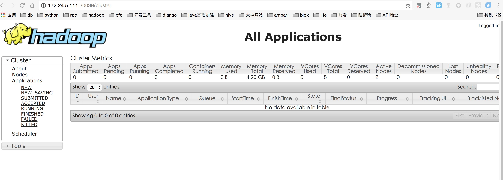
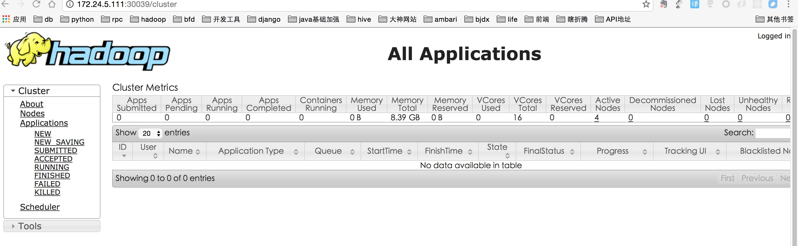

### 创建namespace
```bash
kubectl create -f yarn-cluster-namespace.yaml
```
### 启动zookeeper集群
```bash
sh zk.sh start
```
### 查看zookeeper服务启动状态
```bash
➜  zk-demo kubectl get statefulset
NAME      DESIRED   CURRENT   AGE
zk        3         3         2m

➜  zk-demo kubectl get svc
NAME          CLUSTER-IP    EXTERNAL-IP   PORT(S)             AGE
zk-headless   None          <none>        2888/TCP,3888/TCP   3m

➜  zk-demo kubectl get pods
NAME        READY     STATUS    RESTARTS   AGE
zk-0        1/1       Running   0          5m
zk-1        1/1       Running   0          4m
zk-2        1/1       Running   0          4m

➜  zk-demo kubectl get pv
NAME            CAPACITY   ACCESSMODES   RECLAIMPOLICY   STATUS     CLAIM                            REASON    AGE
datadir-0       10Gi       RWX           Retain          Bound      yarn-cluster-lp/datadir-zk-2               5m
datadir-1       10Gi       RWX           Retain          Bound      yarn-cluster-lp/datadir-zk-0               5m
datadir-2       10Gi       RWX           Retain          Bound      yarn-cluster-lp/datadir-zk-1               5m

➜  zk-demo kubectl get pvc
NAME           STATUS    VOLUME      CAPACITY   ACCESSMODES   AGE
datadir-zk-0   Bound     datadir-1   10Gi       RWX           5m
datadir-zk-1   Bound     datadir-2   10Gi       RWX           5m
datadir-zk-2   Bound     datadir-0   10Gi       RWX           5m
```

### 测试zookeeper是否可用
```bash
➜  zk-demo sh test.sh
################ hostname ####################
zk-0
zk-1
zk-2
################ echo myid ###################
myid zk-0
1
myid zk-1
2
myid zk-2
3
############### hostname -f ###################
zk-0.zk-headless.yarn-cluster-lp.svc.cluster.local
zk-1.zk-headless.yarn-cluster-lp.svc.cluster.local
zk-2.zk-headless.yarn-cluster-lp.svc.cluster.local
############## zoo.cfg #######################
zk-0 zoo.cfg
#This file was autogenerated by k8szk DO NOT EDIT
clientPort=2181
dataDir=/var/lib/zookeeper/data
dataLogDir=/var/lib/zookeeper/log
tickTime=2000
initLimit=10
syncLimit=2000
maxClientCnxns=60
minSessionTimeout= 4000
maxSessionTimeout= 40000
autopurge.snapRetainCount=3
autopurge.purgeInteval=1
server.1=zk-0.zk-headless.yarn-cluster-lp.svc.cluster.local:2888:3888
server.2=zk-1.zk-headless.yarn-cluster-lp.svc.cluster.local:2888:3888
server.3=zk-2.zk-headless.yarn-cluster-lp.svc.cluster.local:2888:3888


zk-1 zoo.cfg
#This file was autogenerated by k8szk DO NOT EDIT
clientPort=2181
dataDir=/var/lib/zookeeper/data
dataLogDir=/var/lib/zookeeper/log
tickTime=2000
initLimit=10
syncLimit=2000
maxClientCnxns=60
minSessionTimeout= 4000
maxSessionTimeout= 40000
autopurge.snapRetainCount=3
autopurge.purgeInteval=1
server.1=zk-0.zk-headless.yarn-cluster-lp.svc.cluster.local:2888:3888
server.2=zk-1.zk-headless.yarn-cluster-lp.svc.cluster.local:2888:3888
server.3=zk-2.zk-headless.yarn-cluster-lp.svc.cluster.local:2888:3888


zk-2 zoo.cfg
#This file was autogenerated by k8szk DO NOT EDIT
clientPort=2181
dataDir=/var/lib/zookeeper/data
dataLogDir=/var/lib/zookeeper/log
tickTime=2000
initLimit=10
syncLimit=2000
maxClientCnxns=60
minSessionTimeout= 4000
maxSessionTimeout= 40000
autopurge.snapRetainCount=3
autopurge.purgeInteval=1
server.1=zk-0.zk-headless.yarn-cluster-lp.svc.cluster.local:2888:3888
server.2=zk-1.zk-headless.yarn-cluster-lp.svc.cluster.local:2888:3888
server.3=zk-2.zk-headless.yarn-cluster-lp.svc.cluster.local:2888:3888


create /hello world
Connecting to localhost:2181
2017-01-11 06:13:26,265 [myid:] - INFO  [main:Environment@100] - Client environment:zookeeper.version=3.4.9-1757313, built on 08/23/2016 06:50 GMT
2017-01-11 06:13:26,270 [myid:] - INFO  [main:Environment@100] - Client environment:host.name=zk-0.zk-headless.yarn-cluster-lp.svc.cluster.local
2017-01-11 06:13:26,271 [myid:] - INFO  [main:Environment@100] - Client environment:java.version=1.8.0_111
2017-01-11 06:13:26,277 [myid:] - INFO  [main:Environment@100] - Client environment:java.vendor=Oracle Corporation
2017-01-11 06:13:26,277 [myid:] - INFO  [main:Environment@100] - Client environment:java.home=/usr/lib/jvm/java-8-openjdk-amd64/jre
2017-01-11 06:13:26,277 [myid:] - INFO  [main:Environment@100] - Client environment:java.class.path=/usr/bin/../build/classes:/usr/bin/../build/lib/*.jar:/usr/bin/../share/zookeeper/zookeeper-3.4.9.jar:/usr/bin/../share/zookeeper/slf4j-log4j12-1.6.1.jar:/usr/bin/../share/zookeeper/slf4j-api-1.6.1.jar:/usr/bin/../share/zookeeper/netty-3.10.5.Final.jar:/usr/bin/../share/zookeeper/log4j-1.2.16.jar:/usr/bin/../share/zookeeper/jline-0.9.94.jar:/usr/bin/../src/java/lib/*.jar:/usr/bin/../etc/zookeeper:
2017-01-11 06:13:26,277 [myid:] - INFO  [main:Environment@100] - Client environment:java.library.path=/usr/java/packages/lib/amd64:/usr/lib/x86_64-linux-gnu/jni:/lib/x86_64-linux-gnu:/usr/lib/x86_64-linux-gnu:/usr/lib/jni:/lib:/usr/lib
2017-01-11 06:13:26,278 [myid:] - INFO  [main:Environment@100] - Client environment:java.io.tmpdir=/tmp
2017-01-11 06:13:26,278 [myid:] - INFO  [main:Environment@100] - Client environment:java.compiler=<NA>
2017-01-11 06:13:26,278 [myid:] - INFO  [main:Environment@100] - Client environment:os.name=Linux
2017-01-11 06:13:26,278 [myid:] - INFO  [main:Environment@100] - Client environment:os.arch=amd64
2017-01-11 06:13:26,278 [myid:] - INFO  [main:Environment@100] - Client environment:os.version=4.7.3-coreos-r1
2017-01-11 06:13:26,279 [myid:] - INFO  [main:Environment@100] - Client environment:user.name=root
2017-01-11 06:13:26,279 [myid:] - INFO  [main:Environment@100] - Client environment:user.home=/root
2017-01-11 06:13:26,279 [myid:] - INFO  [main:Environment@100] - Client environment:user.dir=/
2017-01-11 06:13:26,281 [myid:] - INFO  [main:ZooKeeper@438] - Initiating client connection, connectString=localhost:2181 sessionTimeout=30000 watcher=org.apache.zookeeper.ZooKeeperMain$MyWatcher@1de0aca6
2017-01-11 06:13:26,325 [myid:] - INFO  [main-SendThread(localhost:2181):ClientCnxn$SendThread@1032] - Opening socket connection to server localhost/127.0.0.1:2181. Will not attempt to authenticate using SASL (unknown error)
2017-01-11 06:13:26,427 [myid:] - INFO  [main-SendThread(localhost:2181):ClientCnxn$SendThread@876] - Socket connection established to localhost/127.0.0.1:2181, initiating session
2017-01-11 06:13:26,465 [myid:] - INFO  [main-SendThread(localhost:2181):ClientCnxn$SendThread@1299] - Session establishment complete on server localhost/127.0.0.1:2181, sessionid = 0x1598c235fd20000, negotiated timeout = 30000

WATCHER::

WatchedEvent state:SyncConnected type:None path:null
Created /hello
create /hello world success
get /hello
Connecting to localhost:2181
2017-01-11 06:13:28,501 [myid:] - INFO  [main:Environment@100] - Client environment:zookeeper.version=3.4.9-1757313, built on 08/23/2016 06:50 GMT
2017-01-11 06:13:28,505 [myid:] - INFO  [main:Environment@100] - Client environment:host.name=zk-1.zk-headless.yarn-cluster-lp.svc.cluster.local
2017-01-11 06:13:28,506 [myid:] - INFO  [main:Environment@100] - Client environment:java.version=1.8.0_111
2017-01-11 06:13:28,509 [myid:] - INFO  [main:Environment@100] - Client environment:java.vendor=Oracle Corporation
2017-01-11 06:13:28,509 [myid:] - INFO  [main:Environment@100] - Client environment:java.home=/usr/lib/jvm/java-8-openjdk-amd64/jre
2017-01-11 06:13:28,509 [myid:] - INFO  [main:Environment@100] - Client environment:java.class.path=/usr/bin/../build/classes:/usr/bin/../build/lib/*.jar:/usr/bin/../share/zookeeper/zookeeper-3.4.9.jar:/usr/bin/../share/zookeeper/slf4j-log4j12-1.6.1.jar:/usr/bin/../share/zookeeper/slf4j-api-1.6.1.jar:/usr/bin/../share/zookeeper/netty-3.10.5.Final.jar:/usr/bin/../share/zookeeper/log4j-1.2.16.jar:/usr/bin/../share/zookeeper/jline-0.9.94.jar:/usr/bin/../src/java/lib/*.jar:/usr/bin/../etc/zookeeper:
2017-01-11 06:13:28,510 [myid:] - INFO  [main:Environment@100] - Client environment:java.library.path=/usr/java/packages/lib/amd64:/usr/lib/x86_64-linux-gnu/jni:/lib/x86_64-linux-gnu:/usr/lib/x86_64-linux-gnu:/usr/lib/jni:/lib:/usr/lib
2017-01-11 06:13:28,510 [myid:] - INFO  [main:Environment@100] - Client environment:java.io.tmpdir=/tmp
2017-01-11 06:13:28,511 [myid:] - INFO  [main:Environment@100] - Client environment:java.compiler=<NA>
2017-01-11 06:13:28,511 [myid:] - INFO  [main:Environment@100] - Client environment:os.name=Linux
2017-01-11 06:13:28,511 [myid:] - INFO  [main:Environment@100] - Client environment:os.arch=amd64
2017-01-11 06:13:28,511 [myid:] - INFO  [main:Environment@100] - Client environment:os.version=4.7.3-coreos-r2
2017-01-11 06:13:28,511 [myid:] - INFO  [main:Environment@100] - Client environment:user.name=root
2017-01-11 06:13:28,512 [myid:] - INFO  [main:Environment@100] - Client environment:user.home=/root
2017-01-11 06:13:28,512 [myid:] - INFO  [main:Environment@100] - Client environment:user.dir=/
2017-01-11 06:13:28,513 [myid:] - INFO  [main:ZooKeeper@438] - Initiating client connection, connectString=localhost:2181 sessionTimeout=30000 watcher=org.apache.zookeeper.ZooKeeperMain$MyWatcher@1de0aca6
2017-01-11 06:13:28,578 [myid:] - INFO  [main-SendThread(localhost:2181):ClientCnxn$SendThread@1032] - Opening socket connection to server localhost/127.0.0.1:2181. Will not attempt to authenticate using SASL (unknown error)
2017-01-11 06:13:28,655 [myid:] - INFO  [main-SendThread(localhost:2181):ClientCnxn$SendThread@876] - Socket connection established to localhost/127.0.0.1:2181, initiating session
2017-01-11 06:13:28,676 [myid:] - INFO  [main-SendThread(localhost:2181):ClientCnxn$SendThread@1299] - Session establishment complete on server localhost/127.0.0.1:2181, sessionid = 0x2598c236f640000, negotiated timeout = 30000

WATCHER::

WatchedEvent state:SyncConnected type:None path:null
world
cZxid = 0x100000002
ctime = Wed Jan 11 06:13:26 UTC 2017
mZxid = 0x100000002
mtime = Wed Jan 11 06:13:26 UTC 2017
pZxid = 0x100000002
cversion = 0
dataVersion = 0
aclVersion = 0
ephemeralOwner = 0x0
dataLength = 5
numChildren = 0
get /hello  success
```
可以看到上面在zk上成功创建了一个名为 /hello 节点，里面的数据是 "world".并成功获取了该节点的数据。说明该zookeeper集群正常

### 启动yarn
#### 初始化zookeeper节点
```bash
sh kube-hadoop.sh init zk
```
#### 查看是否成功初始化
```bash
➜  kube-yarn git:(master) ✗ kubectl exec zk-0 zkCli.sh ls /
Connecting to localhost:2181
2017-01-11 06:28:45,075 [myid:] - INFO  [main:Environment@100] - Client environment:zookeeper.version=3.4.9-1757313, built on 08/23/2016 06:50 GMT
2017-01-11 06:28:45,080 [myid:] - INFO  [main:Environment@100] - Client environment:host.name=zk-0.zk-headless.yarn-cluster-lp.svc.cluster.local
2017-01-11 06:28:45,080 [myid:] - INFO  [main:Environment@100] - Client environment:java.version=1.8.0_111
2017-01-11 06:28:45,083 [myid:] - INFO  [main:Environment@100] - Client environment:java.vendor=Oracle Corporation
2017-01-11 06:28:45,083 [myid:] - INFO  [main:Environment@100] - Client environment:java.home=/usr/lib/jvm/java-8-openjdk-amd64/jre
2017-01-11 06:28:45,084 [myid:] - INFO  [main:Environment@100] - Client environment:java.class.path=/usr/bin/../build/classes:/usr/bin/../build/lib/*.jar:/usr/bin/../share/zookeeper/zookeeper-3.4.9.jar:/usr/bin/../share/zookeeper/slf4j-log4j12-1.6.1.jar:/usr/bin/../share/zookeeper/slf4j-api-1.6.1.jar:/usr/bin/../share/zookeeper/netty-3.10.5.Final.jar:/usr/bin/../share/zookeeper/log4j-1.2.16.jar:/usr/bin/../share/zookeeper/jline-0.9.94.jar:/usr/bin/../src/java/lib/*.jar:/usr/bin/../etc/zookeeper:
2017-01-11 06:28:45,084 [myid:] - INFO  [main:Environment@100] - Client environment:java.library.path=/usr/java/packages/lib/amd64:/usr/lib/x86_64-linux-gnu/jni:/lib/x86_64-linux-gnu:/usr/lib/x86_64-linux-gnu:/usr/lib/jni:/lib:/usr/lib
2017-01-11 06:28:45,084 [myid:] - INFO  [main:Environment@100] - Client environment:java.io.tmpdir=/tmp
2017-01-11 06:28:45,084 [myid:] - INFO  [main:Environment@100] - Client environment:java.compiler=<NA>
2017-01-11 06:28:45,084 [myid:] - INFO  [main:Environment@100] - Client environment:os.name=Linux
2017-01-11 06:28:45,084 [myid:] - INFO  [main:Environment@100] - Client environment:os.arch=amd64
2017-01-11 06:28:45,084 [myid:] - INFO  [main:Environment@100] - Client environment:os.version=4.7.3-coreos-r1
2017-01-11 06:28:45,085 [myid:] - INFO  [main:Environment@100] - Client environment:user.name=root
2017-01-11 06:28:45,085 [myid:] - INFO  [main:Environment@100] - Client environment:user.home=/root
2017-01-11 06:28:45,085 [myid:] - INFO  [main:Environment@100] - Client environment:user.dir=/
2017-01-11 06:28:45,087 [myid:] - INFO  [main:ZooKeeper@438] - Initiating client connection, connectString=localhost:2181 sessionTimeout=30000 watcher=org.apache.zookeeper.ZooKeeperMain$MyWatcher@1de0aca6
2017-01-11 06:28:45,117 [myid:] - INFO  [main-SendThread(localhost:2181):ClientCnxn$SendThread@1032] - Opening socket connection to server localhost/0:0:0:0:0:0:0:1:2181. Will not attempt to authenticate using SASL (unknown error)
2017-01-11 06:28:45,199 [myid:] - INFO  [main-SendThread(localhost:2181):ClientCnxn$SendThread@876] - Socket connection established to localhost/0:0:0:0:0:0:0:1:2181, initiating session
2017-01-11 06:28:45,211 [myid:] - INFO  [main-SendThread(localhost:2181):ClientCnxn$SendThread@1299] - Session establishment complete on server localhost/0:0:0:0:0:0:0:1:2181, sessionid = 0x1598c235fd20004, negotiated timeout = 30000

WATCHER::

WatchedEvent state:SyncConnected type:None path:null
[bfdoffline, hello, zookeeper, rmstore]
```
可以看到已经在zookeeper的根节点下创建了 bfdoffline 和 rmstore两个子节点.这2个节点是用于yarn的主备切换. 节点创建成功，说明zk初始化已经完成.
#### 启动yarn
```
➜  kube-yarn git:(master) ✗ sh kube-hadoop.sh start yarn
configmap "hadoop-config" deleted
configmap "hadoop-config" created
service "yarn-nm" created
statefulset "yarn-nm" created
kubectl create -f manifests/yarn-nm-petset.yaml --namespace=yarn-cluster-lp
service "yarn-rm" created
service "yarn-ui" created
statefulset "yarn-rm" created
kubectl create -f manifests/yarn-rm-petset.yaml --namespace=yarn-cluster-lp
```
#### 查看yarn状态
```bash
➜  kube-yarn git:(master) ✗ kubectl get statefulset
NAME      DESIRED   CURRENT   AGE
yarn-nm   2         2         2m
yarn-rm   2         2         2m
zk        3         3         26m

➜  kube-yarn git:(master) ✗ kubectl get svc
NAME          CLUSTER-IP   EXTERNAL-IP   PORT(S)             AGE
yarn-nm       None         <none>        8088/TCP,8082/TCP   2m
yarn-rm       None         <none>        8088/TCP            2m
yarn-ui       10.100.4.7   <nodes>       8088:30039/TCP      2m
zk-headless   None         <none>        2888/TCP,3888/TCP   27m

➜  kube-yarn git:(master) ✗ kubectl get cm
NAME            DATA      AGE
hadoop-config   8         2m
zk-config       8         27m

➜  kube-yarn git:(master) ✗ kubectl get pods
NAME        READY     STATUS    RESTARTS   AGE
yarn-nm-0   1/1       Running   0          1m
yarn-nm-1   1/1       Running   0          1m
yarn-rm-0   1/1       Running   0          1m
yarn-rm-1   1/1       Running   0          1m
zk-0        1/1       Running   0          26m
zk-1        1/1       Running   0          26m
zk-2        1/1       Running   0          25m
```

#### 通过web-ui访问yarn
```txt
http://172.24.5.111:30039/cluster
```


#### 扩容nodemanager
下面是扩容yarn的计算节点为4个
```bash
kubectl patch statefulset yarn-nm -p '{"spec":{"replicas": '4'}}' --namespace="yarn-cluster-lp"
```
#### 通过web-ui访问yarn

可以看到nodemanager的节点由原来的2个变成了4个
